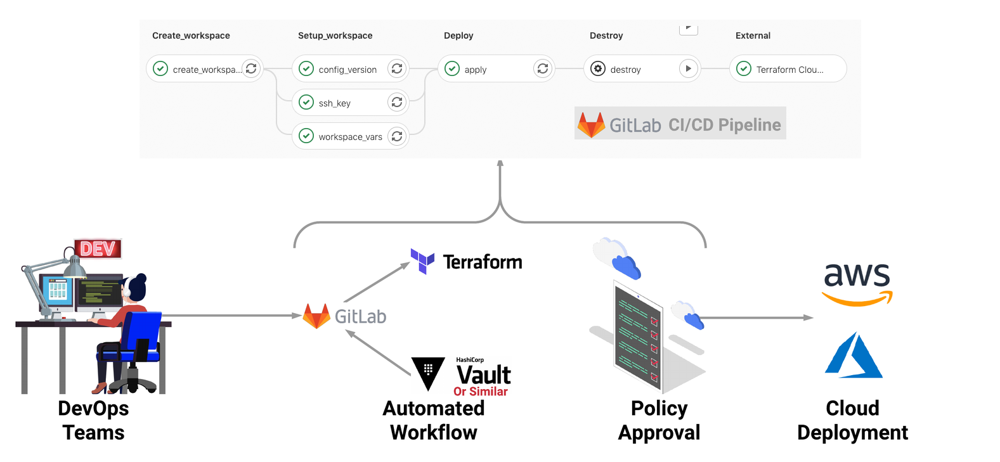

# DO NOT CREATE A NEW BRANCH ON THE BLUEPRINT REPO

## BHP Windows Azure SOE VM Deployment CI/CD Pipeline Template

***About CI/CD Pipeline**

A CI/CD Pipeline is the backbone of the modern DevOps environment. It bridges the gap between development and operations teams by automating the building, testing, and deployment of applications and infrastructure.

**GitLab CI/CD** is a tool built into GitLab for software development through the continuous methodologies:

- Continuous Integration (CI)
- Continuous Delivery (CD)
- Continuous Deployment (CD)

**GitLab CI/CD pipelines** are configured using a YAML file called .gitlab-ci.yml within each project.

The .gitlab-ci.yml file defines the structure and order of the pipelines and determines:

- What to execute using [GitLab Runner](https://docs.gitlab.com/runner/).
- What decisions to make when specific conditions are encountered. For example, when a process succeeds or fails.

This template pipeline aims to streamline the BHP SOE VM creation process for Windows in Azure.

## Workflow & Diagram:

GitLab Code Repo ---->  GitLab CI Pipeline ---->  Terraform Cloud ----> AWS/Azure/VMware(on-prem) environment

**Diagram**

*for more details on the SOE Build please refer to the following Confluence pages:*
*[Cloud SOE Development](https://bhptechsi.atlassian.net/wiki/spaces/CLOUD/pages/1193644329/Cloud+SOE+Development+Notes)*

## Before Script

In this step, we set the env vars:

- **ENVIRONMENT** for the environemnt the VM is going to be deployed to (dev,stg,prd, npe)
- **SUBSCRIPTION_ID** the Azure sub id where the VM is goign to be deployed to
- **TFC_ADDR** the Terraform Cloud URL 
- **TFC_ORG** the Terraform Cloud Organisation for this project
- **TFC_SSHKEY_NAME** the Terraform Cloud SSHKEY 
- **TFC_WORKSPACE** the Terraform Cloud Workspace name that follows the BHP naming convention
All the secrets are hidden in the pipeline run logs.

## Stages

***Stage “Validate“:***

Validates if:

- The variable file name to specify the environemnt using ENV env var is set. This can be passed to the pipeline or set in the gitlab-ci.yml file. The var file exists under env_vars folder so for example if the environment is **prd**, we need to set ENVIRONMENT="prd" and the variable file name should be prd.auto.tfvars.

- SUBSCRIPTION_ID is another input parameter that needs to be set either in the gitlab-ci.yml under variables section or passed to the pipeline as a parameter

***Stage “Setup Workspace“:***

Pipeline makes API calls to TFC using the token just fetched from Azure Key Vault, to provision a Workspace in TFC.
Then setup Workspace by uploading the tfvars and all tf files, set the TFC environment variables and terraform variables as the steps below

1. It’ll push the *.tf and*.tfvars to the TFC.
2. Also setup Environment and Terraform vars such as ARM_CLIENT_ID, ARM_CLIETN_SECRET, ARM_SUBSCRIPTION_ID, ARM_TENANT_ID and spoke var as sensitive. 
3. Also it will set up TFC SSH Key, which is used for downloading Terraform modules from [Git-based module sources](https://www.terraform.io/docs/modules/sources.html). 
4. Pipeline makes API calls to TFC to start a run in TFC, equivalent to “Queue a Plan“ in TFC console. TFC will run terraform plan. Currently, the default behavior is Apply needs confirmation in TFC console. 

***Stage "SCOM Agent Approval":***

In this stage using the var file we register the scom agent for this VM (it works if there's only one VM is being provisioned in the var file as it takes the computer name from the var file)

## Key Facts

1. This sample pipeline is defined in GitLab CICD with multiple stages.
2. TFC TOKEN is stored in Azure Key Vault, it will be retrieved at every stage
3. Trigger Terraform Cloud run by calling TFC API, automatically create/setup Workspace in TFC, mitigate manual operations.
4. This sample pipeline deploys a Windows SOE VM in Azure. Terraform Destroy is last stage in the pipeline and runs manually.

## Usage

This is a blueprint, so do NOT create another branch on this repo. 

1. Create a subgroup under azure-apps
2. Create a new project
3. Clone master branch of this repo for newly created repo
4. Modify the tfvars file from the env_vars folder for your preferred environment
5. Make sure the tfvars file name follows this naming convention {ENV}.auto.tfvars where {ENV} is the environment you would like your VM to be deployed to. For example for dev environment ENVIRONMENT="dev" in .gitlab-ci.yml and tfvars file name is dev.auto.tfvars. For prd environment ENVIRONMENT="prd" and tfvars file name is prd.auto.tfvars
6. Only modify the fetch_secrets.sh file TFC_TOKEN when you are using a different TFC organisation rather than unified-azure-lz
7. This pipeline automatically create a Workspace name using this naming convention {CLOUD_SERVICE_PROVIDER}-{ASSET}-{REGION}-{ENV}-{PROJECT_TITLE} e.g m-it-aue1-appprojectname under TFC Org you specified in the variables section of the gitlab-ci file. You can modify it in export variables setup in before_script section however it is not recommended.
8. Update *.auto.tfvars with your Terraform vars, please NOTE*.tfvars doesn't work in TFC.
9. Make sure there's an available Gitlab runner and then change the GitLab Runner's tag name to yours (After you have provisioned one for this app) in --tags under "default:" section in gitlab-ci.yml file.

**Important Notes:**

1. In order to deploy more than one VM please refer to the example at the bottom of this page to understand how the `vm_list` variable should be configured
2. To finalise the deployment/destruction, user needs to click on *Confirm & Apply* button in the Terraform Cloud Console
3. The Admin or Operator AD Group members are comma separated lists and must be used in this format {Domain}/{Group/User}/{Member Name} like: *dc_admin_group_members = "ENT/Group/member1,APAC/User/member2,APAC/Group/member3"*
4. By default VM backup is enabled and the standard values for backup attributes (policy_name, vault_name and resource_group_name) will be populated automatically. If users can change the standard values by adding *backup_policy_name*, *recovery_vault_name*, *rsv_resource_group_name* and their new vaules in the tfvars file in the vm object

## Input Variables Explanation (tfvars)

| Name | Description | Example |
|------|-------------|---------|
| vm_list | List of VM details to be deployed | check the example at the bottom of this page |
| create_vm_resource_group | To create a new resource group if required to deploy the vm into | true (false by default) |
| resource_group_name | vm resource group name | it-aue1-npe-arg-tdj |
| network_resource_group_name | vnet resource group name | it-aue1-npe-arg-network |
| admin_password_key_vault_name | the name of the Azure Key Vault secret for vm admin password | soe-vm-admin-password |
| ops_key_vault_id | the Azure Key Vault id used to store the secrets such as dc-password, vm-admin-username, vm-admin-password, etc.. | |
| dc_password_key_vault_name | the name of the Azure Key Vault secret for dc-password | soe-dc-password |
| storage_account_sub_id | the subscription id of the diagnostics vm extension component | |
| key_vault_sub_id | the subscription id of the azure key vault holding the secrets | |
| bhp_image_reference | the details of the shared image gallery holds the latest SOE Golden Images | `{name = "WindowsServer2019", gallery_name = "itaue1corlzimages", resource_group_name = "it-aue1-cor-lz"}` |
| domain | the domain object containing all the domain details the vm should join to | `{dc_shortname = "ENT" dc_admin_members = "ENT/Group/AD-Group-Name", dc_operator_members = "ENT/User/pa_abcd5"}` | 
| exclude_diagnostics | the flag to identify vm diagnostics should be enabled or not | true/false (false by default) |
| app_critical | If this object's is_critical attribute is set to true AppDynamics will be installed on the VM, platform attribute shows which version of it aspnet or java | app_critical = { is_critical = true, platform = "dotnet"} |
| enable_backup | to enable or disable the VM backup (enabled by default) | true/false (true by default) |
| data_disk | A list of data disks to attach to the windows VM | `data_disks = { "Data" = { name="data" storage_account_type="Premium_LRS" disk_size_gb=128 caching="ReadOnly" lun= 11 }}` |
| install_iis | If it is set IIS and its managementtools will be installed on the VM | true/false (false by default) |
| install_dotnet_framework | If it is set .NET Framework will be installed on the VM | true/false (false by default) |
| enable_app_insights | Enable Azure Application Insights | false:true (false by default) |
| datadog_enabled | Is the datadog vm extension to be installed on this VM? | 0/1 (1 by default) |
| log_analytics | Log analytics and alert rules | refer to the default value in the variable file |
| environment | Which environment this VM is getting deployed to (prd, npe) | prd/npe |

Below is an example on how to prepare the `vm_list` map of objects for two vms. You can extend this to deploy as many vms as you need in one environment

```env.auto.tvfars
### VM List specs ###
vm_list = {
  "vm1" = {
    create_vm_resource_group         = true
    base_name                        = ""
    name                             = "MAUE10TSND001"
    computer_name                    = "MAUE10TSND001"
    computer_description             = "Windows Server 2019 VM1"
    resource_group_name              = "it-aue1-npe-arg-tdj"
    location                         = "Australia East" 
    network_resource_group_name      = "it-aue1-npe-arg-network"
    subnet_name                      = "sub-iaas"
    virtual_network_name             = "it-aue1-npe-vnt-10.125.41.0" 
    private_ip_address_allocation    = "Static"
    private_ip_addresses             = ["10.125.41.11"]
    size                             = "Standard_DS1_v2"
    disk_size_gb                     = 128
    storage_account_type             = "StandardSSD_LRS"
    storage_account_name             = "bcpdiagaueavm"
    storage_account_rg               = "it-auea-cor-logs"
    custom_data                      = ""
    backup_policy_name               = "Non-Production_VM" // "Leave blank for default value or provide respective policy name as per environment"
    recovery_vault_name              = "it-aue1-npe-rsv-grs" // "Leave blank for default value or provide recovery vault name as per environment"
    rsv_resource_group_name          = "it-aue1-npe-arg-backup" // "Leave blank for default value or provide resource group name as per environment"
  }
  },
  "vm2" = {
    create_vm_resource_group         = false
    base_name                        = ""
    name                             = "MAUE10TSND002"
    computer_name                    = "MAUE10TSND002"
    computer_description             = "Windows Server 2019 VM2"
    resource_group_name              = "it-aue1-npe-arg-tdj"
    location                         = "Australia East" 
    network_resource_group_name      = "it-aue1-npe-arg-network"
    subnet_name                      = "sub-iaas"
    virtual_network_name             = "it-aue1-npe-vnt-10.125.41.0" 
    private_ip_address_allocation    = "Static"
    private_ip_addresses             = ["10.125.41.12"]
    size                             = "Standard_DS1_v2"
    disk_size_gb                     = 128
    storage_account_type             = "StandardSSD_LRS"
    storage_account_name             = "bcpdiagaueavm"
    storage_account_rg               = "it-auea-cor-logs"
    custom_data                      = ""
    backup_policy_name               = "Non-Production_VM" // "Leave blank for default value or provide respective policy name as per environment"
    recovery_vault_name              = "it-aue1-npe-rsv-grs" // "Leave blank for default value or provide recovery vault name as per environment"
    rsv_resource_group_name          = "it-aue1-npe-arg-backup" // "Leave blank for default value or provide resource group name as per environment"
  }
}
```
### Sharepoint Link ###

https://spo.bhpbilliton.com/sites/cloud/SitePages/BPAZR005--Windows-SOE-VM.aspx
